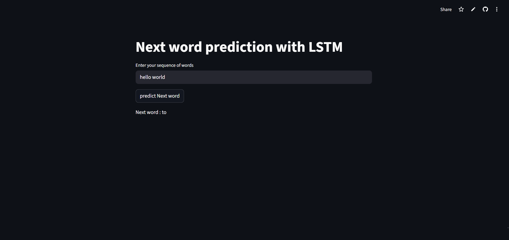

# Next Word Prediction using LSTM

A **Natural Language Processing (NLP)** project that predicts the **next word in a sentence** using a **Long Short-Term Memory (LSTM) neural network**.

The application is deployed using **Streamlit**, allowing users to input a sequence of words and receive the predicted next word based on the trained model.

---
## Live link :- https://alok-nextwordpredictor-goku.streamlit.app/

---


## Application Preview




---

# Project Overview

Next-word prediction is an important task in **language modeling**. It is widely used in modern applications such as:

* Google keyboard suggestions
* ChatGPT-style text generation
* Email autocomplete
* Speech recognition systems

This project trains an **LSTM-based neural network** on a text dataset to learn word sequences and predict the most probable next word.

---

# How It Works

The system follows the standard **NLP deep learning pipeline**:

Text Dataset
↓
Text Cleaning & Tokenization
↓
Word Indexing
↓
Sequence Generation
↓
Padding Sequences
↓
Embedding Layer
↓
LSTM Layer
↓
Dense + Softmax
↓
Next Word Prediction

---

# Model Architecture

Input Layer
↓
Embedding Layer
↓
LSTM Layer
↓
Dense Layer (Softmax)

### Embedding Layer

Converts words into **dense vector representations** so the neural network can understand semantic relationships.

Example representation:

hello → [0.21, -0.4, 0.87, ...]
world → [0.12, 0.56, -0.19, ...]

---

### LSTM Layer

LSTM captures **long-term dependencies in sequences**.

It works using gates:

* **Forget Gate (ft)** – decides what information to discard
* **Input Gate (it)** – decides what new information to store
* **Cell State (Ct)** – long-term memory of the network
* **Output Gate (ot)** – controls the final output

---

### Dense + Softmax

The final dense layer outputs **probabilities for every word in the vocabulary**.

Example:

Input:
hello world

Predicted probabilities:

to → 0.41
is → 0.22
and → 0.17
the → 0.12

The word with the **highest probability** is selected as the next word.

---

# Tech Stack

* Python
* TensorFlow / Keras
* LSTM Neural Networks
* Streamlit
* NumPy
* Pickle

---

# Project Structure

```
next_word_predictor/
│
├── app.py
├── model.h5
├── tokenizer.pickle
├── requirements.txt
│
├── screenshots/
│   └── image.png
│
└── README.md
```

---

# Installation

### 1. Clone the repository

```
git clone https://github.com/Alok-kumar-priyadarshi/next-word-predictor.git
cd next-word-predictor
```

---

### 2. Create a virtual environment

```
python -m venv venv
```

Activate it:

Windows

```
venv\Scripts\activate
```

Mac / Linux

```
source venv/bin/activate
```

---

### 3. Install dependencies

```
pip install -r requirements.txt
```

---

### 4. Run the application

```
streamlit run app.py
```

---

# Example

Input:

```
hello world
```

Output:

```
Next word: to
```

---

# Learning Outcomes

This project demonstrates:

* Sequence modeling using **LSTM**
* NLP preprocessing
* Tokenization and padding
* Language modeling
* Deploying ML models using **Streamlit**

---

# Future Improvements

Possible improvements include:

* Using **Bidirectional LSTM**
* Training on a larger dataset
* Showing **Top-5 predictions**
* Deploying with **Docker**
* Replacing LSTM with **Transformer models**

---

# Ethical Considerations

When developing NLP systems:

* Ensure training data does not contain harmful bias
* Avoid generating misleading or harmful content
* Make clear that predictions are **statistical probabilities**, not factual statements

---

# Author

**Alok Kumar Priyadarshi**

Computer Science Student interested in
Artificial Intelligence, Machine Learning, and Generative AI
